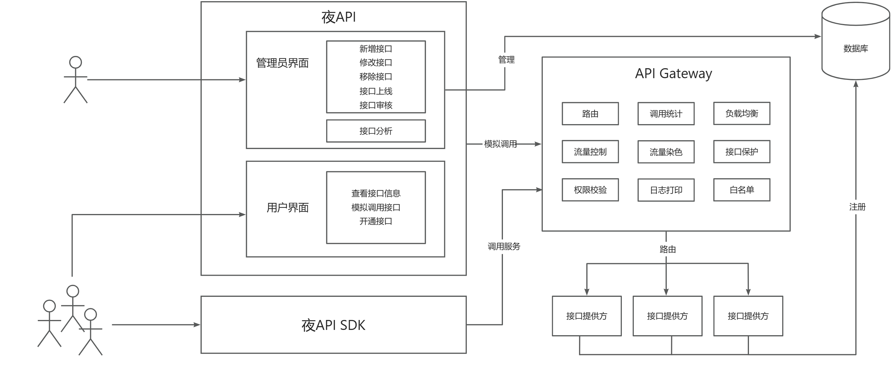
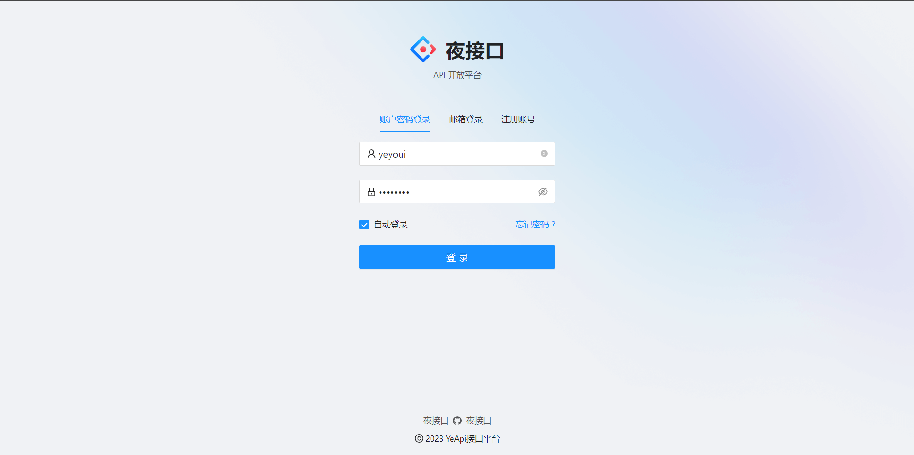
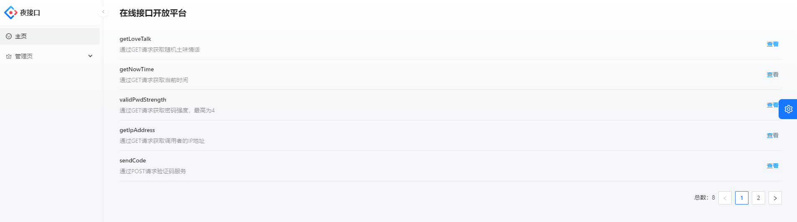
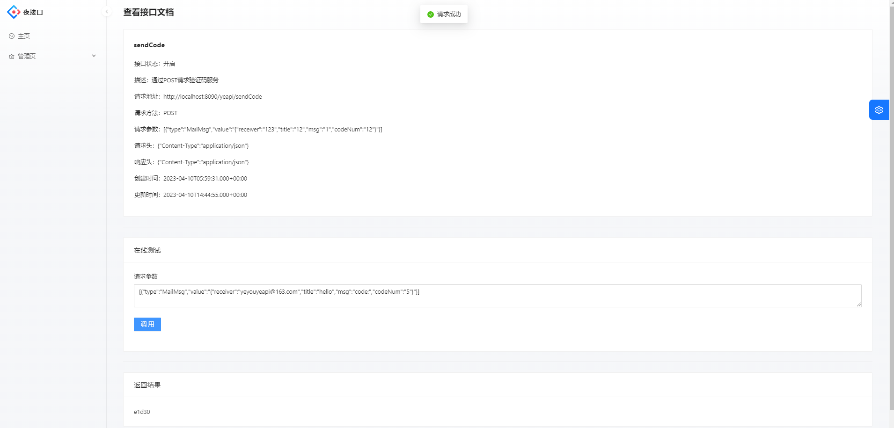

# 夜API开放平台
## 介绍
这是一个接口开发平台，初衷是为了开发者能够方便便捷的获取他们感兴趣的服务和功能。通过该平台。能够方便的使用一些常用的服务，比如验证码服务、翻译服务订单等等。另外，该平台也提供接口接入服务，开发者能够将自己的服务接入到该平台中，方便其他开发者、用户使用。
## 项目背景
市面上已经有很多API平台了，他们一般都是自己提供接口给用户使用。夜API开放平台的重点主要是开放，希望能够搭建一个开放的API平台，开发者可以将自己服务接入API平台，方便其他开发者使用。
## 项目意义
API平台提供的这些功能一般都是一些程序或者网站常用的功能，可以帮助开发者更便捷的搭建他们的平台。对于用户来说，他们也能找到需要的功能，提高他们的体验。
## 项目亮点
1. 提供了一个开放的平台，所有用户都能使用接口服务或者申请提供接口服务。
2. 为方便调用开发了SDK，开发者要使用接口只需调用方法即可，如果使用SpringBoot开发，只需将注入即可使用。
3. 提供了模拟调用的网站，用户能够直观的看到参数和返回值。
4. 使用了SpringGateway作为网关，提供路由、鉴权、调用计数等功能，不仅能保障接口安全性、还能提供额外的服务。
5. 网关与后台服务器之间使用RPC方式调用，不仅提高了传输效率，还避免了引入数据库的代码的冗余。
6. 采用SOA结构搭建，方便今后拓展服务
## 业务流程图

## 主体设计
## 页面展示
### 登录

### 接口列表

### 接口调用

## yeApi后台
### 1.用户管理
#### 用户注册
1. 校验账号密码
2. 分配秘钥
3. 添加用户

#### 用户登录

1. 校验账号密码
2. 用户信息session存入redis
3. 登录

### 2.API签名认证

#### 实现

通过HTTP HEAD传递信息

> 参数1：accessKey：调用标识
>
> 参数2：加密的secretKey：(秘钥不可直接放入请求头)
>
> 参数3：用户请求参数
>
> 参数4：sign
>
> 参数5：随机数（防止重放攻击）
>
> 参数6：时间戳（用于定时清除存储的随机数）

- 客户端：将用户参数+secretKey作为参数生成不可解密的值（使用签名生成算法，服务器同样使用该方法生成值来判断，可以提取为工具类），然后填充请求头信息

- 服务端：先检查时间戳是否过期，再检查随机数是否重复，然后才从数据库查询用户的AK SC，通过用户传递的参数，再次生成sign并与客户端传递的sign对比，如果不同则无权限

### 3.接口管理
#### 上线接口

1. 检查传入的参数信息
2. 检查用户信息（只有接口创建者和管理员才能操作）
3. 查找接口是否存在
4. 调用接口以校验接口有效性
5. 更新接口信息

#### 下线接口

1. 检查传入的参数信息
2. 检查用户信息（只有接口创建者和管理员才能操作）
3. 查找接口是否存在
4. 调用接口以校验接口有效性
5. 更新接口信息

#### 新增接口
1. 校验信息
2. 更新接口
#### 修改接口
1. 检查用户权限
2. 校验信息
3. 更新接口
#### 删除接口
1. 检查用户权限
2. 删除接口
#### 查询接口
1. 分页或者全列表查询
2. 数据脱敏

### 4.接口模拟调用
1. 校验请求参数
2. 校验请求接口状态
3. 获取用户AKSK
4. 获取接口参数，然后通过反射工具类调用对应的接口
4. 调用接口并且返回
### 5.接口调用关系

#### 管理员调用
1. 接口的增删改查
#### 业务需求
1. 用户调用接口时能够自动更新
2. 用户每次调用时，对应接口调用次数加1

## yeApi网关
### 1.路由
在配置文件中配置路由信息
### 2.全局拦截器
1. 请求日志
2. 获取请求头中的数据
3. 检查目标ID是否是白名单用户
4. 接口是否存在
5. 用户鉴权
    1. 检查时间戳是否大于5分钟
    2. 在5分钟内随机数是否重新收到（不能收到重复的随机数 使用Redis实现）
    3. 将数据进行签名运算，然后对比客户端发来的签名
6. 修改路由信息，转向正确的接口服务器地址
7. 服务染色，将接口秘钥MD5签名后添加到请求头中，方便接口提供方校验来源
8. 请求转发，调用接口
9. 响应日志
10. 检查调用情况
    1. 调用成功：调用次数+1
    2. 调用失败：返回错误码
